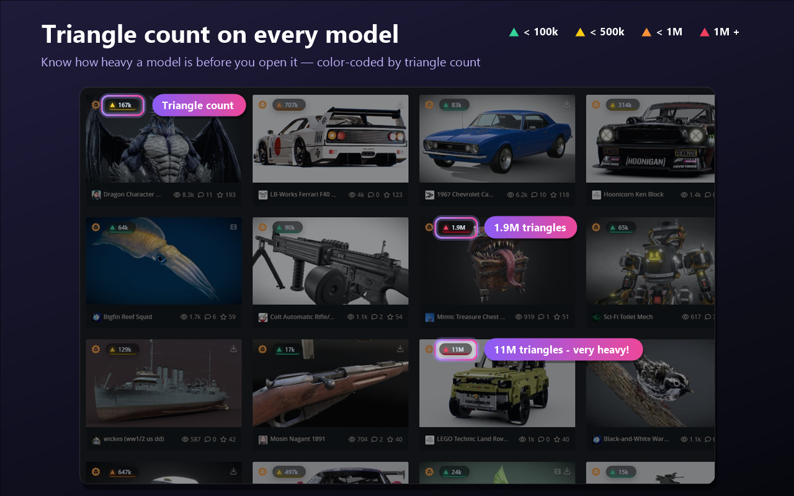
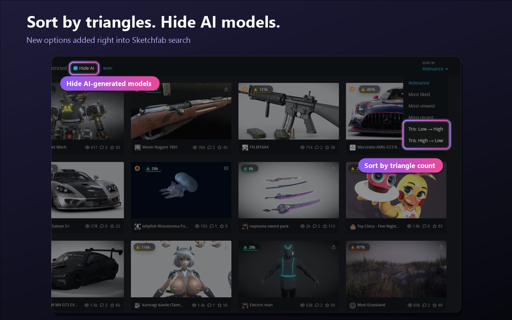
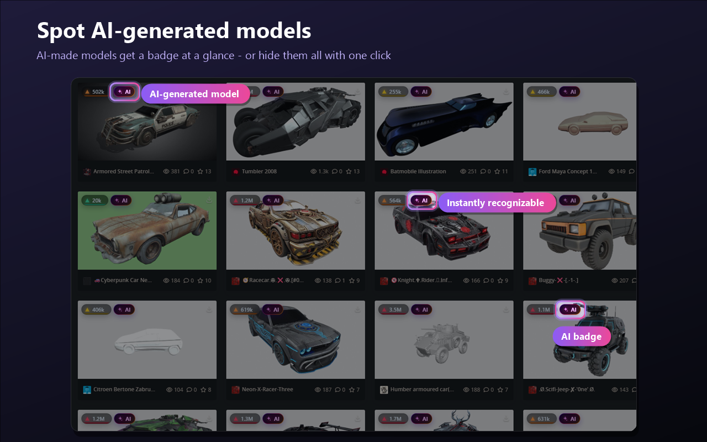

  

<h1 align="center">PolyPeek</h1>

  <b>Triangle counts, tri sorting and an AI filter for Sketchfab, right on the model cards.</b>

  
  
  
  

---

Sketchfab doesn't show how heavy a model is until you open it. **PolyPeek** adds that information to every model card, lets you sort search results by triangle count, and helps you spot or hide AI-generated models.

## Features

### ▲ Triangle count on every card
Each model card gets a badge with its triangle count, color-coded by weight:

| Color | Triangles |
|---|---|
| 🟢 Green | < 100k |
| 🟡 Yellow | < 500k |
| 🟠 Orange | < 1M |
| 🔴 Red | ≥ 1M |

Hover a card to also see its vertex count.

### ↕ Sort search by triangles
Two new options in Sketchfab's **Sort by** menu: **Tris: Low → High** and **Tris: High → Low**.
Broken models with 0 triangles are filtered out automatically when sorting from low to high.

### 🚫 Hide AI
A **Hide AI** checkbox next to Sketchfab's own filters removes AI-generated models from search results.
If hiding them leaves the page nearly empty, PolyPeek loads more results automatically.

### ✦ AI badge
Models marked as AI-generated get a small **AI** badge, so you can recognize them at a glance.

## Installation

### Chrome Web Store
PolyPeek is currently **in review** on the Chrome Web Store. The link will be added here once it's published.

### Manual install (Chrome / Edge)
1. [Download this repository](../../archive/refs/heads/main.zip) and unzip it.
2. Open `chrome://extensions` (or `edge://extensions`).
3. Turn on **Developer mode** (top right).
4. Click **Load unpacked** and select the `extension` folder.
5. Open [sketchfab.com](https://sketchfab.com) and start browsing.

## How it works

| File | Purpose |
|---|---|
| [`extension/content.js`](extension/content.js) | Adds triangle and AI badges to model cards |
| [`extension/search-ui.js`](extension/search-ui.js) | Adds the sort options, the Hide AI checkbox and auto "load more" |
| [`extension/search-patch.js`](extension/search-patch.js) | Adjusts Sketchfab's own search requests (runs in the page context) |

- Triangle count, vertex count and the AI flag come from Sketchfab's model endpoint (`sketchfab.com/i/models/{uid}`). No API token is needed.
- Requests are only made for cards that are visible on screen, with at most 4 at a time and automatic retry on rate limits.
- Results are cached in your browser for 7 days.
- Sorting uses Sketchfab's own `sort_by=faceCount` / `-faceCount` search parameters.
- **Hide AI** removes models with `isAiGenerated: true` from search responses before the page renders them, since Sketchfab has no server-side AI filter.

> PolyPeek relies on Sketchfab's internal web endpoints, not a documented public API. If Sketchfab changes its site, some features may stop working until PolyPeek is updated. Please [open an issue](../../issues) if you notice something broken.

## Privacy

PolyPeek collects **no data**: no analytics, no tracking, no accounts. It only talks to sketchfab.com, and everything it stores stays in your browser.
See the full [privacy policy](PRIVACY.md).

## Legacy userscript

The original Tampermonkey userscript (Sketchfab Poly Count) is kept in [`legacy/`](legacy/) for existing users. It is no longer maintained; please use the extension instead.

## License

[MIT](LICENSE) © Mehmet Akif Ceylan

*PolyPeek is an independent project and is not affiliated with or endorsed by Sketchfab or Epic Games.*
